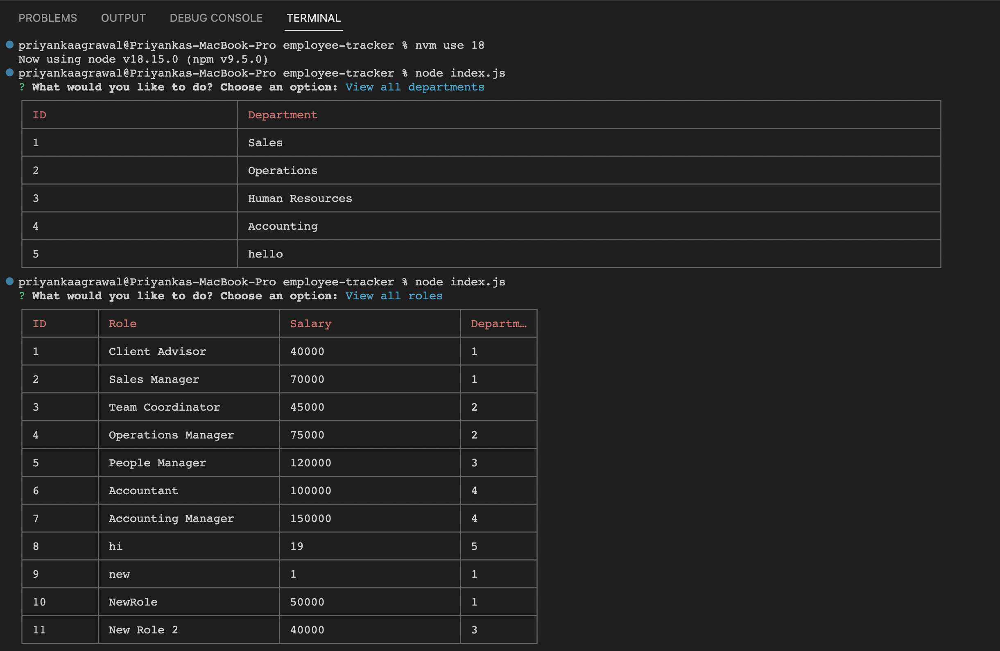

# Employee Tracking Database

## Command-line application which easily allows a client acces the employee database of an organization to view departments, employees and their roles

## Installation
+ Node.js must be installed to the user's device in order for this application to function (ensure Version 18 is in use when running)
+ The NPM package, Inquirer (version ^8.2.4) must be installed for this application to function accurately, as well as Express and CLI-TABLE

## Usage

+ Link to Screencastify: https://drive.google.com/file/d/1pzqIDKE5Nat1cvJbxo9UbBXEsbQISdiS/view
+ Link to Github Repo: https://github.com/priyanka-agrawal025/employee-tracker

## Credits
+ There were no collaborators on this project

## Licenses
+ An MIT License was used for this project

## Badges

